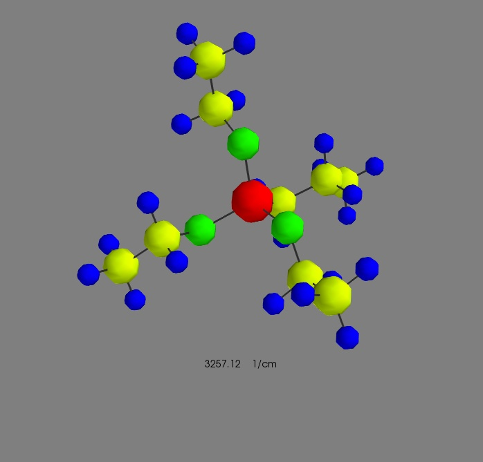

# 3D animation of calculated molecule vibrations with python and mayavi

## Description
Psi4 is an open-source quantum chemistry package (http://www.psicode.org/). It can be used to calculate the frequencies and displacement vectors of the harmonic vibrations of a molecule.
This notebook shows how to load and parse the output file of a Psi4 calculation and how to visualize the vibrations as a 3D-animation. I've included two example files.



## Requirements
1. Jupyter Notebook (Ipython Notebook)
2. Numpy 
3. Mayavi 

Tested with python 2.7 64-bit (Anaconda 4.2, Ubuntu 16.10). As of November 2016, Mayavi doesn't seem to work correctly with python 3. But the rest of this code should be compatible with python 3.

Install a python 2.7 environment and all the required packages with anaconda (https://www.continuum.io/downloads):
```bash
$ conda create --name python2_environment python=2
$ conda install ipython-notebook
$ conda install numpy
$ conda install mayavi
```
